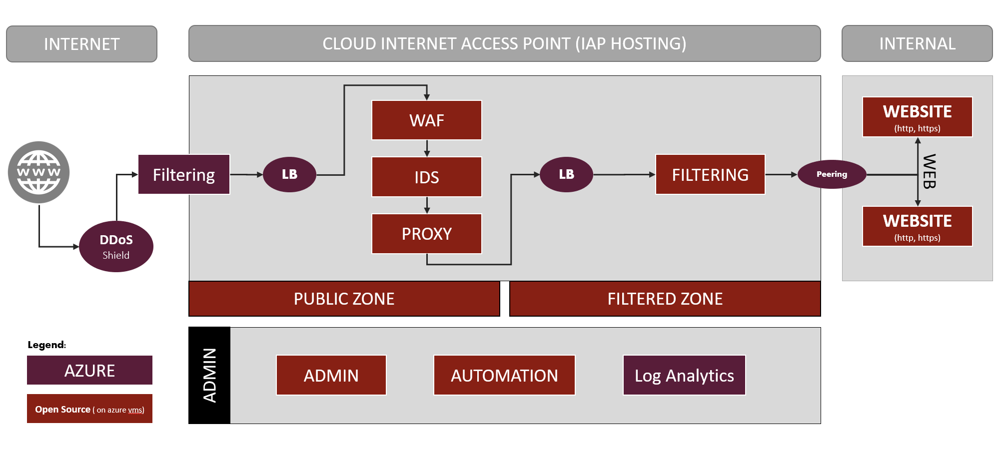

# AZURE cIAP HOSTING

## What is IAP HOSTING ?

**IAP HOSTING** is:

* A cIAP (**c**loud **I**nternet **A**ccess **P**oint). Mainly, it is a **security product** between Internet and your public application hosted in your private zone
* The acronym (with imagination and goodwill) of **Opensource cIAP Nextgen**
* A Societe Generale Open Source project developped by [Marouan BELGHITH](https://www.linkedin.com/in/marwenbelghith/) within **Public Cloud Feature Team (Cloud Center Of Excellence)** of **Societe Generale**
* Compatible on AZURE but **can be modified to use another Cloud Service Provider (OpenStack, Vmware...)** or **bare-metal**, most of components are Linux-based softwares
* An AWS version called *OCTANE* is already available and **OpenSource** [OCTANE](https://github.com/societe-generale/OCTANE)

## Why IAP HOSTING ?

**IAP HOSTING** can: 

* **Securly expose** a WebSite to Internet
* Protect you against **intrusions** (SQL injection, cross-site scripting (XSS), file inclusion...) & **virus**
* Limit you against **deny of service**
* Detect **malicious activities** or **policy violations**
* Securly **expose your Private Apps** to Internet
* Collect **all the logs** and provide **metrics and analytics**
* Be **easily derivated on other x86** (OpenStack, Bare-Metal) platform in order to have **the same Internet Access Point in a multi-cloud context** 
* AWS version is already published and **OpenSource** [OCTANE](https://github.com/societe-generale/OCTANE)

Features are:

* [**SSL Offloading**](#ssl-offloading)
* [**Web Application Firewall**](#web-application-firewall)
* [**Two layers of IP filtering**](#ip-filtering)
* [**Intrusion Detection System**](#intrusion-detection-system)
* [**Centralized Logs**](#centralized-logs)

### SSL Offloading

HTTPS connections are terminated on the `CIAP Hosting`. This is a requirement to inspect the request.

### Web Application Firewall

To **secure access to the Web Application**, the `CIAP Hosting` implements a **Web Application Firewall (WAF)**. This component inspects requests made to the Application and will **detect and block** those **considered as unsafe**. Typically, it provides protections againt most of the attacks likereported by the **Open Web Application Security Project ([OWASP](https://www.owasp.org/))**.

### IP Filtering

The `CIAP Hosting` uses **two security providers to filter requests** to the Web Application:

- Security groups provided by the _Cloud Service Provider_
- A third-party firewall

### Intrusion Detection System

To **secure access to the Web Application**, the `CIAP Hosting` implements an **Intrusion Detection System (IDS)**. This component inspects requests made to the Application and will **detect and block** those **considered as unsafe**.

### Centralized Logs

The `CIAP Hosting` keep the logs **365 days** using *Azure Log Analytics solution*

## How (Architecture) ?

There are several layers (from the most exposed -Internet- to the less exposed -Internal-):

* redundant load-balancers
* redundant filtering layer
* redundant reverse-proxies
* redundant proxies with SSL terminaison
* redundant WAF or TCP relay (it depends on the protocol used)
* redundant Antivirus & IDS
* redundant firewalls
* AZURE Private DNS or Azure Virtual Network peering

Those functionnalities are deployed by:
* The **Terraform** aims to build the AZURE infrastructure (Virtual Machines, LoadBalancers, Network Security Groups ...)
* The **ansible playbook** will configure all software components (inside Virtual Machines and even connectivity through Azure)

For further details, a more complete READme is available in each directory.

## Detailed documentation

### Architecture

* [Detailled architecture](documentation/architecture.md)
* [Ansible](Instance/ansible/READme.md)
* [Terraform](Instance/README.md)

### Run & Installation

* [Run book](documentation/run.md)
* [Installation guide](documentation/install.md)

## Roadmap

* Autoscaling group implementation
* Common referential
* API to manage web exposition
* IDS choice: suricata/snort

## License

[GPLv2](https://www.gnu.org/licenses/old-licenses/gpl-2.0.en.html)

## Authors

This project has been created in 2020 by [Marouan BELGHITH](https://github.com/marwenB), Domain Owner by [Lucas BARRIERE](https://github.com/urluba) and Product Owner by [Yannick NEFF](https://github.com/yannickneff)

## Contributors

* [Eric BOUTEVILLE](https://github.com/qrn77)
* [Lucas BARRIERE](https://github.com/urluba)
* [Abderrahmane SMIMITE](https://github.com/ab-smith)
* [Pascal RENAZEAU](https://github.com/rnzp90)
* [Yannick NEFF](https://github.com/yannickneff)

## Softwares / Used components

## Sponsorship

