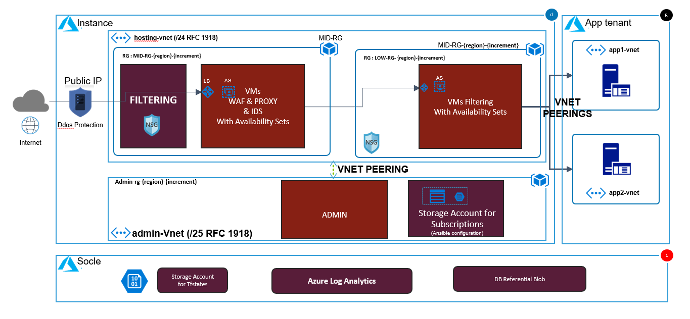
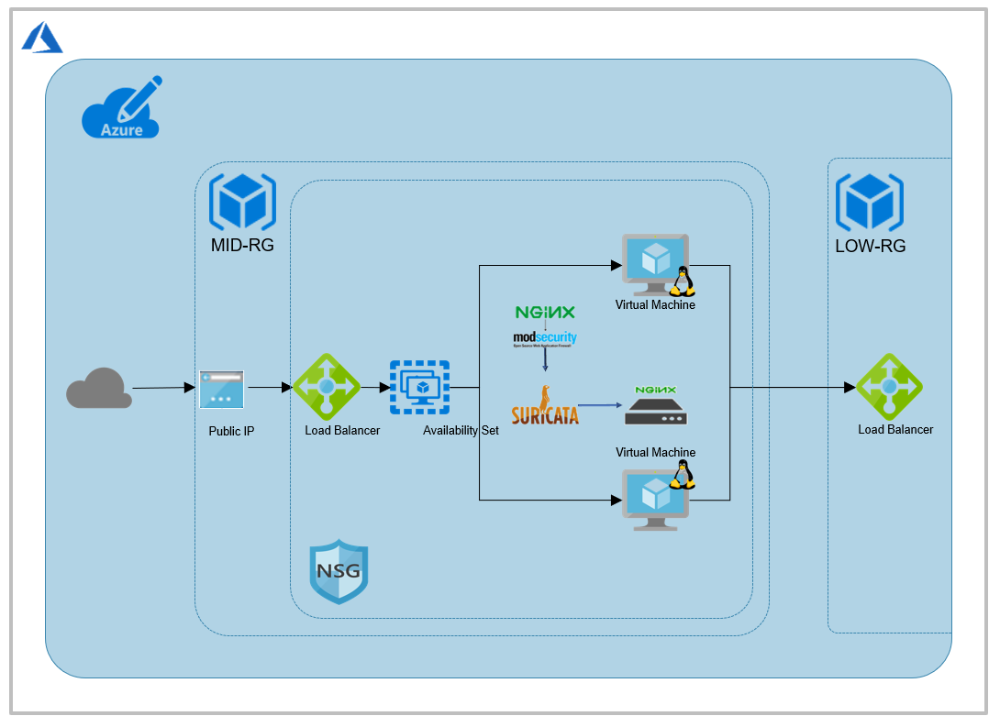
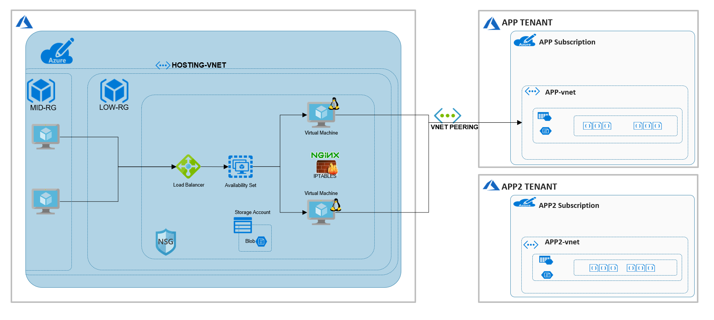
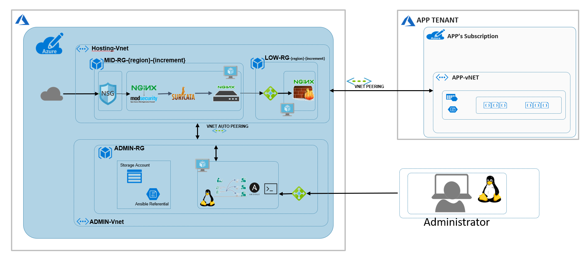
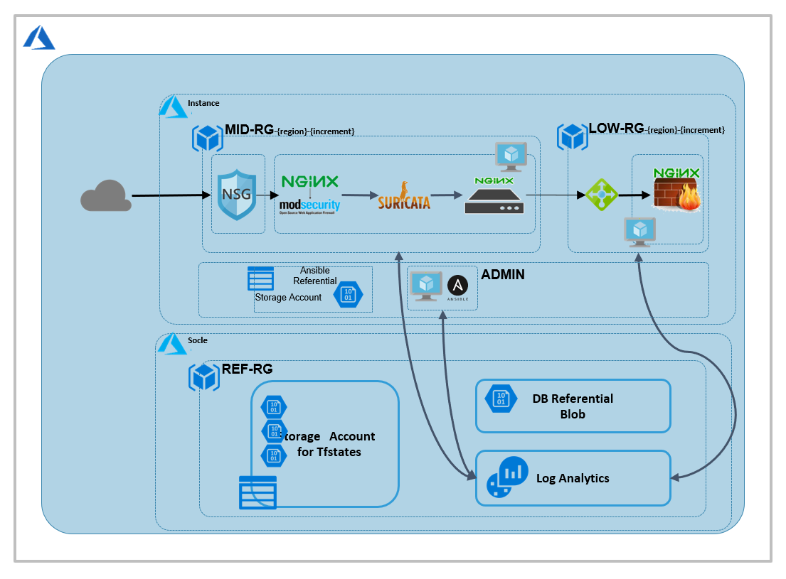

# AZURE cIAP Hosting 

## Presentation

This section is the detailed architecture (low-level design)

### Low level design

### Low level design: Filtered zone

### Low level design: Private zone

### Low level design: Admin zone

### Low level design: Socle 

